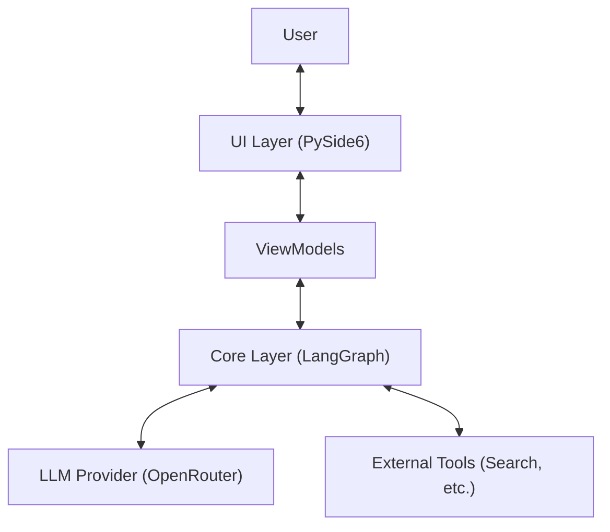
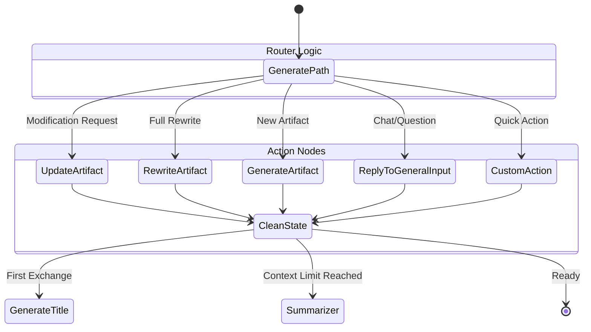
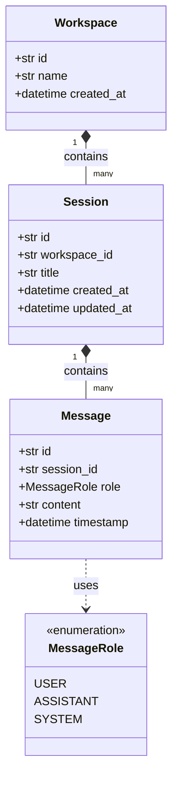

# Attractor Desk Architecture

## Overview
**Attractor Desk** is a Python-based AI writing and coding assistant, evolved from the Open Canvas concept. It combines a powerful backend cognitive engine with a native desktop user interface to provide a seamless collaborative experience. The system is designed to manage "artifacts"—structured content like code or text—that users can iterate on with the help of LLMs.

## System Architecture

The application follows a clear separation of concerns between the backend logic (Core) and the frontend presentation (UI).

- **Core Layer (`core/`)**: Handles all business logic, LLM interactions, and state management. It uses LangGraph to define the agent's cognitive flow.
- **UI Layer (`ui/`)**: A desktop application built with PySide6 (Qt for Python). It observes the Core state and renders the interface, following the Model-View-ViewModel (MVVM) pattern.

### High-Level Components

## Core Layer Details

The Core is the brain of Attractor Desk. It is designed to be UI-agnostic, meaning it could theoretically power a CLI or web app as well.

### 1. LangGraph Engine (`core/graphs/`)
The agent's behavior is driven by a state machine defined in `core/graphs/open_canvas/graph.py`.

#### State Definition (`OpenCanvasState`)
The state of the graph tracks the conversation, current artifacts, and routing decisions.

| Field | Type | Description |
|-------|------|-------------|
| `messages` | `list[BaseMessage]` | The visible chat history between user and assistant. |
| `internal_messages` | `list[BaseMessage]` | Hidden messages used for reasoning, summary, or tool results. |
| `artifact` | `ArtifactV3` | The current active artifact (code or text) being worked on. |
| `highlighted_code` | `CodeHighlight` | Range of code currently selected by the user. |
| `next` | `str` | The next node to execute (determined by the `generatePath` router). |

#### Graph Logic & Routing
The graph begins at `generatePath`, which analyzes the user's input and state to decide the next step.

**Key Nodes:**
- **`generatePath`**: An LLM call that decides user intent (chat vs. artifact work).
- **`generateArtifact`**: Creates a new artifact from scratch.
- **`rewriteArtifact`**: Rewrites an entire artifact based on feedback.
- **`updateArtifact`**: Applies specific updates to a portion of an artifact (e.g., fixing a bug in a function).
- **`replyToGeneralInput`**: Handles general conversation that doesn't require artifact modification.

### 2. Data Storage & Models (`core/models.py`)

The application uses a hierarchical data model to organize user work. Currently, this is persisted in-memory or via simple file storage, but the models are designed for extensibility (e.g., SQLite).

#### UML Class Diagram

- **`Workspace`**: The top-level container, representing a project or a user's isolated environment.
- **`Session`**: A specific conversation thread (like a "Chat" in ChatGPT).
- **`Message`**: The individual units of communication.

### 3. types.py
The `core/types.py` file defines the Pydantic models that mirror the original TypeScript Open Canvas types, ensuring compatibility and strict validation for:
- **`ArtifactV3`**: The artifact container supporting versioning.
- **`ArtifactContent`**: Union of `ArtifactCodeV3` and `ArtifactMarkdownV3`.
- **`Reflections`**: User memory/preferences.

## UI Layer Details

The UI layer creates a reactive interface over the Core state.

- **`ChatViewModel`**: The primary ViewModel. It initializes the `OpenCanvasState` and `graph`. It exposes signals (Qt Signals) when the state changes (e.g., `message_received`, `artifact_updated`).
- **`ArtifactsPanel`**: Observes the `artifact_updated` signal to render the current artifact. It supports syntax highlighting and diff views.
- **`ChatPanel`**: Renders the `messages` list and captures user input.

## Key Technologies
- **Language**: Python 3.11+
- **Agent Framework**: LangChain / LangGraph
- **GUI Framework**: PySide6 (Qt)
- **LLM Interface**: OpenRouter
