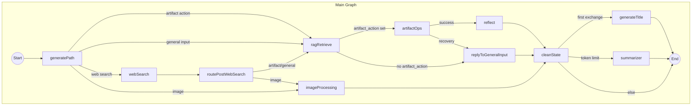
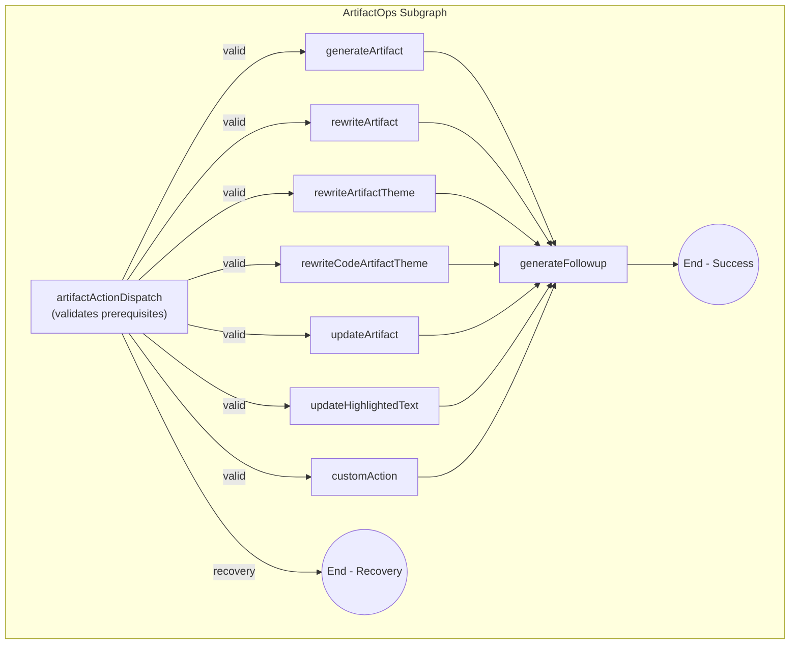
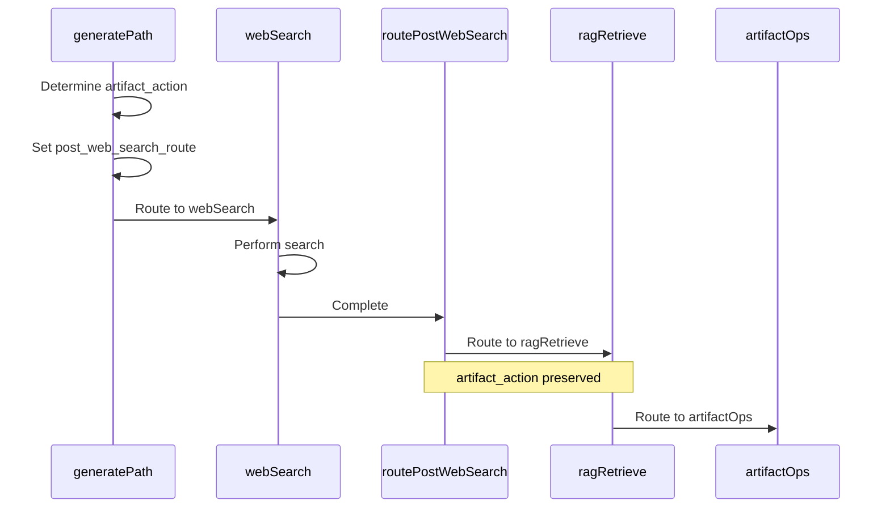

# LangGraph OpenCanvas Architecture

This document describes the architecture of the OpenCanvas LangGraph, including the main graph structure, subgraphs, and routing logic.

## Overview

The OpenCanvas graph orchestrates conversation and artifact generation through explicit phases:

1. **Routing Phase** - `generatePath` determines the action based on user input
2. **Contextualization Phase** - RAG retrieval and web search gather relevant context
3. **Artifact Operations Phase** - `ArtifactOps` subgraph handles all artifact mutations
4. **Housekeeping Phase** - Reflection, state cleanup, and title generation

## Graph Structure



## ArtifactOps Subgraph

The ArtifactOps subgraph centralizes all artifact mutation operations with a single entry point for validation and dispatch.



## Key State Fields

### Routing Fields

| Field | Type | Purpose |
|-------|------|---------|
| `next` | `Optional[str]` | Next node to route to in the graph |
| `artifact_action` | `Optional[str]` | Artifact operation to perform (e.g., `generateArtifact`, `rewriteArtifact`) |
| `artifact_action_params` | `Optional[dict]` | Optional parameters for the artifact action |
| `artifact_action_recovery_message` | `Optional[str]` | Deterministic recovery message for soft failures |
| `post_web_search_route` | `Optional[str]` | Intended route after web search completes |

### Artifact Action Flow

1. **`generatePath`** sets `artifact_action` and routes to `ragRetrieve`
2. **`ragRetrieve`** performs RAG retrieval, then routes based on `artifact_action` presence
3. **`artifactActionDispatch`** validates prerequisites:
   - Missing artifact → soft-fail with recovery message
   - Missing highlight → soft-fail with recovery message
   - Unknown action → hard-fail with exception
4. **Action nodes** perform the artifact mutation
5. **`generateFollowup`** creates follow-up messages
6. **`route_artifact_ops_exit`** routes to either `reflect` (success) or `replyToGeneralInput` (recovery)

## Validation Logic

### Soft Failures

When prerequisites are missing but the request is valid, the dispatch returns a recovery message:

```python
# Missing artifact
"I'd be happy to help with that, but there's no artifact to modify yet. 
Would you like me to create one first?"

# Missing highlight selection
"I need to know which part of the artifact you'd like me to update. 
Please select the text you want to modify."
```

### Hard Failures

Invariant violations raise `ArtifactOpsError`:

- `artifact_action` is `None` when entering the subgraph
- Unknown action key (not in `VALID_ARTIFACT_ACTIONS`)
- Invalid artifact structure

## Action Classification

| Action | Requires Artifact | Requires Highlight |
|--------|-------------------|-------------------|
| `generateArtifact` | No | No |
| `rewriteArtifact` | Yes | No |
| `rewriteArtifactTheme` | Yes | No |
| `rewriteCodeArtifactTheme` | Yes | No |
| `updateArtifact` | Yes | No |
| `updateHighlightedText` | Yes | Yes |
| `customAction` | Yes | No |

## Web Search Integration

Web search preserves the intended artifact action:



## Testing

The ArtifactOps subgraph can be tested in isolation:

```python
from core.graphs.open_canvas.artifact_ops import artifact_action_dispatch

# Test validation
state = OpenCanvasState(artifact_action="rewriteArtifact", artifact=None)
result = await artifact_action_dispatch(state)
assert result["next"] == "__recovery__"
assert "no artifact" in result["artifact_action_recovery_message"]
```

## Files

| File | Purpose |
|------|---------|
| `core/graphs/open_canvas/graph.py` | Main graph definition |
| `core/graphs/open_canvas/artifact_ops.py` | ArtifactOps subgraph |
| `core/graphs/open_canvas/state.py` | State definition with routing fields |
| `core/graphs/open_canvas/nodes/generate_path.py` | Initial routing logic |
| `core/graphs/open_canvas/nodes/reply_to_general_input.py` | Handles recovery messages |
| `core/graphs/open_canvas/nodes/clean_state.py` | Clears transient state fields |
| `core/constants.py` | DEFAULT_INPUTS for state cleanup |
