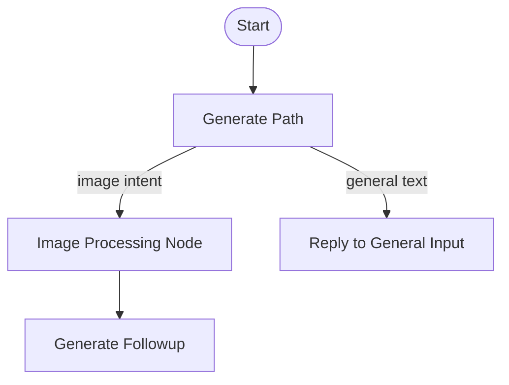

# Architecture Design: Image Processing Node

## Context
The current system uses a single model configuration for most conversational tasks. To support multimodal capabilities (image analysis, generation, etc.) efficiently, we need a dedicated node that can be configured with a specialized model (e.g., GPT-4o, Claude 3.5 Sonnet) while keeping the default text interactions on a potentially different model (e.g., for speed or cost).

## Architecture

### Node Integration
The `imageProcessing` node will be a sibling to `replyToGeneralInput` and artifact nodes.

### Configuration Hierarchy
The graph config `configurable` dictionary will be expanded:
- `model`: Default text model (existing)
- `image_model`: Model for image processing (new)

### Routing Logic
The `generatePath` node (powered by an LLM classifier) determines the intent. We will update the `PathFn` schema or the prompt validation to include an `image_processing` option.

### Image Handling
The `OpenCanvasState` already supports `messages`, which can contain `image_url` or base64 data in LangChain format. The `imageProcessing` node will:
1. Extract the last user message.
2. Check for image content.
3. specific instructions/system prompt for image tasks.
4. Call `get_chat_model` with `model=image_model`.
