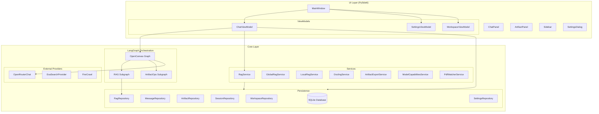
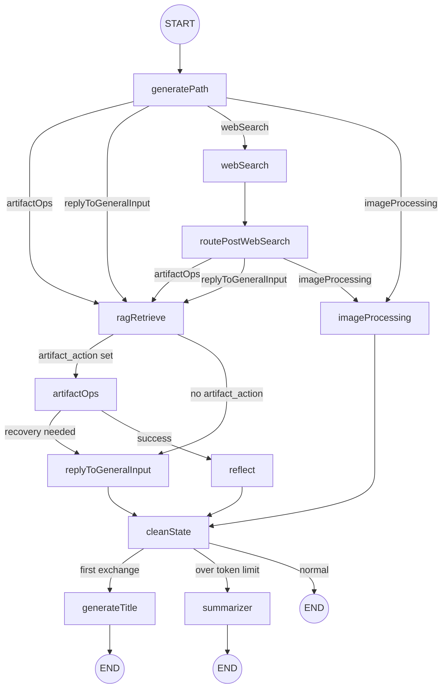
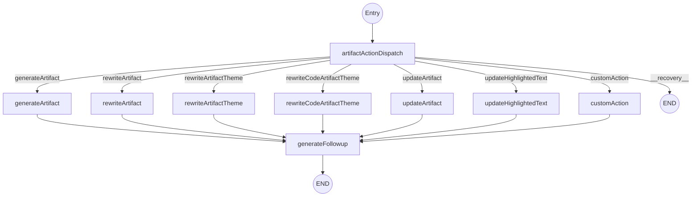
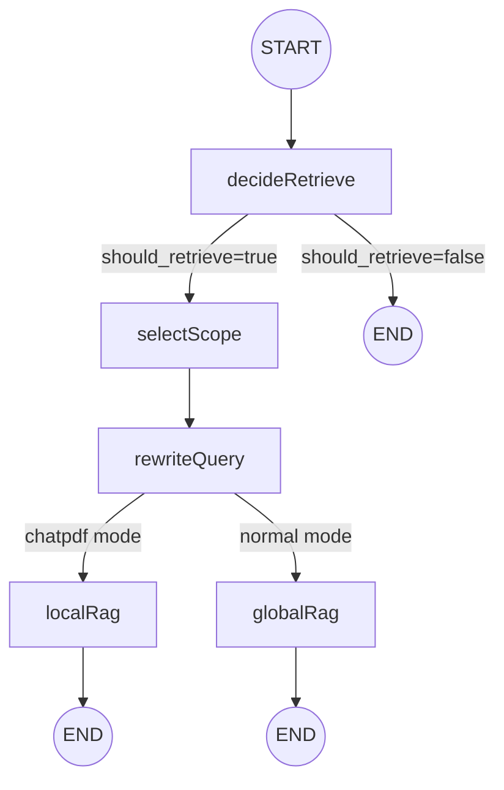
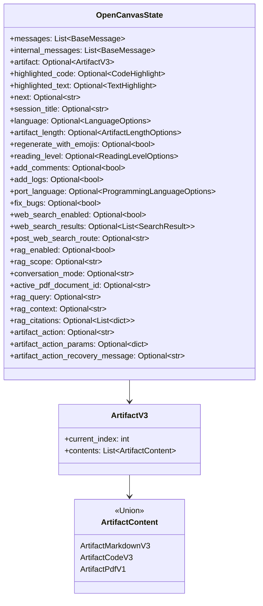
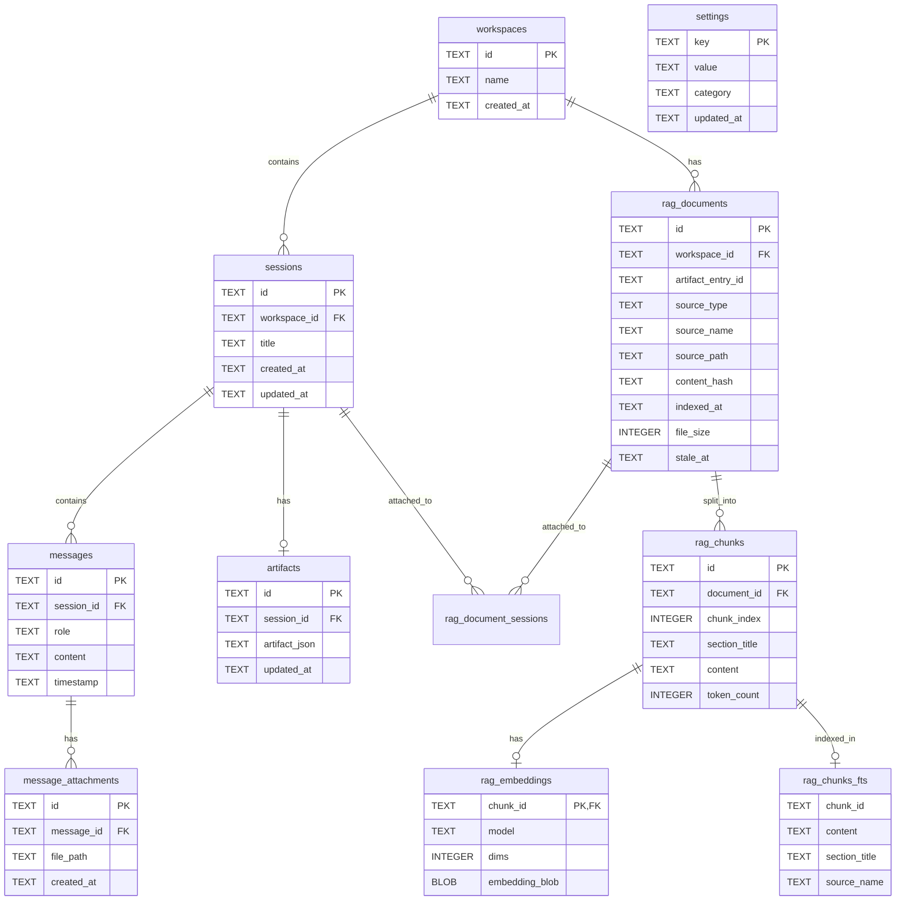
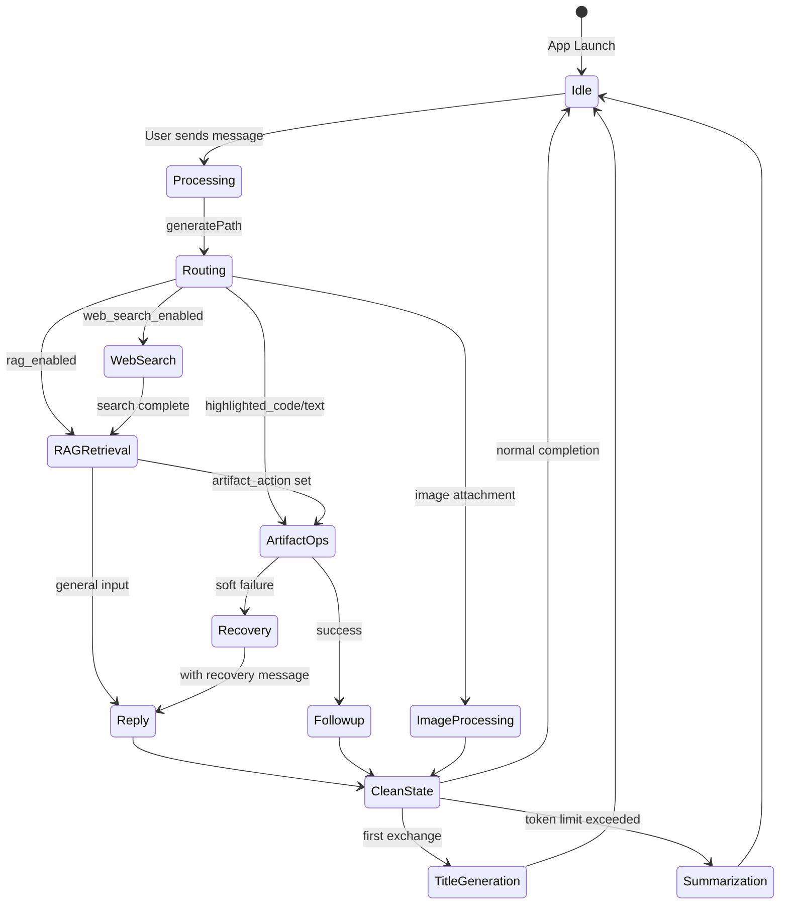
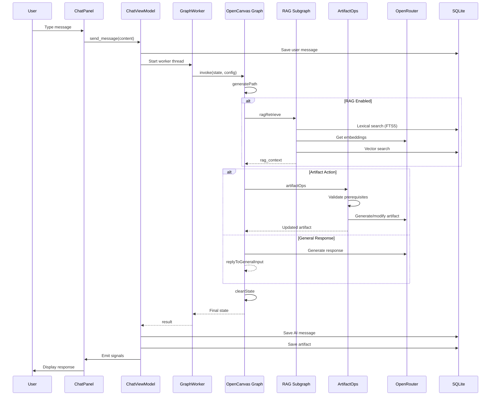
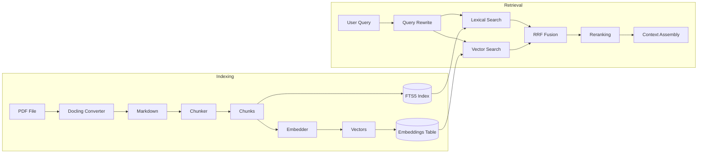

# Attractor Desk - Technical Architecture Report

## Executive Summary

Attractor Desk is a Python desktop application for AI-assisted writing and coding, built on **LangGraph** for agent orchestration, **PySide6** for the UI, and **SQLite** for persistence. The system follows an **MVVM architecture** with strict core/UI separation and employs a sophisticated graph-based execution model for conversation routing, artifact generation, and RAG retrieval.

---

## 1. System Architecture Overview

### 1.1 High-Level Component Diagram



### 1.2 Main Components and Responsibilities

| Component | Responsibility |
|-----------|---------------|
| **MainWindow** | Application shell, keyboard shortcuts, panel coordination |
| **ChatViewModel** | Graph execution, message management, session lifecycle |
| **SettingsViewModel** | Configuration persistence, API key management |
| **OpenCanvas Graph** | Main conversation routing and node orchestration |
| **ArtifactOps Subgraph** | Artifact CRUD operations with validation |
| **RAG Subgraph** | Retrieval-Augmented Generation pipeline |
| **RagService** | Indexing and retrieval with hybrid search (FTS5 + embeddings) |
| **Persistence Layer** | SQLite-based repositories for all domain entities |

### 1.3 Architecture Patterns

1. **MVVM (Model-View-ViewModel)**: UI widgets bind to ViewModels via Qt signals
2. **Repository Pattern**: All database access abstracted through repository classes
3. **Subgraph Composition**: LangGraph subgraphs for modularity (RAG, ArtifactOps)
4. **Worker Thread Pattern**: `QThread` for non-blocking graph execution and PDF processing
5. **State Machine**: LangGraph's `StateGraph` for explicit flow control

---

## 2. LangGraph Execution Graphs

### 2.1 Main OpenCanvas Graph



#### Node Descriptions

| Node | Description |
|------|-------------|
| `generatePath` | Routes user input via explicit flags or LLM classification to appropriate handler |
| `ragRetrieve` | RAG subgraph for context retrieval |
| `replyToGeneralInput` | Generates conversational response without artifact modification |
| `artifactOps` | ArtifactOps subgraph for artifact mutations |
| `webSearch` | Web search via Exa API with classification |
| `routePostWebSearch` | Routes to intended destination after web search completes |
| `imageProcessing` | Handles multimodal image analysis |
| `cleanState` | Clears transient state fields |
| `reflect` | Placeholder for future reflection/learning |
| `generateTitle` | Generates session title after first exchange |
| `summarizer` | Summarizes conversation when exceeding token budget |

### 2.2 ArtifactOps Subgraph



#### Dispatch Logic

1. **Validation**: Checks artifact/highlight prerequisites
2. **Soft Failures**: Missing artifact → sets recovery message, routes to `replyToGeneralInput`
3. **Hard Failures**: Unknown action → raises `ArtifactOpsError`

### 2.3 RAG Subgraph



#### RAG Node Responsibilities

| Node | Description |
|------|-------------|
| `decideRetrieve` | Checks `rag_enabled` flag and extracts user query |
| `selectScope` | Determines scope: `session`, `workspace`, or `global` |
| `rewriteQuery` | Optional query rewriting for better retrieval |
| `globalRag` | Retrieves from global (workspace-wide) index |
| `localRag` | Retrieves from session-specific index (ChatPDF) |

---

## 3. LangGraph State / Data Stores

### 3.1 OpenCanvasState Schema



### 3.2 Database Entity Relationship Diagram



### 3.3 State Transitions



---

## 4. Information Flow

### 4.1 End-to-End Data Flow



### 4.2 RAG Pipeline Flow



---

## 5. Architectural Issues

### 5.1 Tight Coupling: Database Instantiation in Nodes

**Location**: `core/graphs/open_canvas/graph.py:230`, `core/graphs/rag/nodes.py:94`

**Problem**: Graph nodes directly instantiate `Database()` and repositories:
```python
repo = SessionRepository(Database())  # In generate_title_node
repository = RagRepository(Database())  # In _retrieve_with_scope
```

**Why Problematic**:
- Violates Dependency Injection principle
- Makes testing difficult (cannot mock database)
- Creates multiple database connections instead of reusing
- Breaks separation between graph logic and infrastructure

**Recommendation**: Pass database/repositories via `config["configurable"]` or use a dependency container.

---

### 5.2 State Bloat in OpenCanvasState

**Location**: `core/graphs/open_canvas/state.py`

**Problem**: `OpenCanvasState` contains 40+ fields mixing:
- Core conversation state (`messages`, `artifact`)
- Routing metadata (`next`, `artifact_action`)
- Feature flags (`web_search_enabled`, `rag_enabled`)
- Debug information (`rag_retrieval_debug`, `rag_route_debug`)
- Transient values (`highlighted_code`, `highlighted_text`)

**Why Problematic**:
- High cognitive load for developers
- Difficult to reason about state invariants
- Debug fields contaminate production state
- No clear lifecycle management

**Recommendation**: Split into `CoreState`, `RoutingContext`, `RagContext`, `DebugInfo` subclasses.

---

### 5.3 Missing Error Handling in Provider Calls

**Location**: `core/graphs/open_canvas/graph.py:326-329`

**Problem**: Web search errors are caught but silently swallowed:
```python
try:
    results = provider.search_sync(query, num_results=num_results)
except Exception as exc:
    logger.warning("Exa search failed: %s", exc)
```

**Why Problematic**:
- User has no visibility into search failures
- No retry mechanism
- Debug information lost

**Recommendation**: Return error context in state, emit UI signal for user notification.

---

### 5.4 Scalability: In-Memory Embedding Search

**Location**: `core/services/rag_service.py:238-271`

**Problem**: Vector search loads all embeddings into memory and computes cosine similarity in Python:
```python
for chunk_id, blob in rows:
    vec = _blob_to_float_list(blob)
    sim = _cosine_similarity(query_vec, vec, query_norm)
```

**Why Problematic**:
- O(n) memory and compute complexity
- Will not scale beyond ~10K chunks
- No approximate nearest neighbor support

**Recommendation**: Integrate `sqlite-vss` extension or migrate to a vector database (Chroma, Weaviate).

---

### 5.5 Thread Safety: Multiple Database Connections

**Location**: `core/persistence/database.py:209-216`

**Problem**: Thread-local connections without proper transaction management:
```python
def get_connection(self) -> sqlite3.Connection:
    if not hasattr(self._local, "connection") or self._local.connection is None:
        self._local.connection = sqlite3.connect(str(self.db_path))
```

**Why Problematic**:
- Connections never explicitly closed in worker threads
- WAL mode helps but doesn't prevent all race conditions
- No connection pooling

**Recommendation**: Use `sqlite3.connect()` with connection pooling or SQLAlchemy.

---

## 6. Identified Bugs

### 6.1 Race Condition in Session Title Update

**Location**: `core/graphs/open_canvas/graph.py:230-242`

**Bug**: Title generation creates a new `Database()` instance and reads/writes session independently:
```python
repo = SessionRepository(Database())
session = repo.get_by_id(session_id)
# ... modify session ...
repo.update(session)
```

**Why It Occurs**: If the main thread modifies the session concurrently, updates may be lost or overwritten.

**Fix**: Use optimistic locking with a `version` column or pass session from state.

---

### 6.2 Potential Null Pointer in Artifact Content Access

**Location**: `core/graphs/open_canvas/graph.py:198-204`

**Bug**: Artifact content type checking doesn't handle all cases:
```python
if is_artifact_markdown_content(current_content):
    artifact_text = current_content.full_markdown
elif is_artifact_code_content(current_content):
    artifact_text = current_content.code
else:
    artifact_text = ""
```

**Why It Occurs**: `ArtifactPdfV1` type is not handled, and accessing `.code` on it would fail.

**Fix**: Add explicit handling for PDF artifacts or use a polymorphic `get_content_text()` method.

---

### 6.3 Memory Leak in GraphWorker Thread

**Location**: `ui/viewmodels/chat_viewmodel.py:58-71`

**Bug**: `GraphWorker` QThread is created but not properly cleaned up:
```python
self._thread = QThread()
self._worker = GraphWorker(state, config, run_token)
self._worker.moveToThread(self._thread)
# ... later ...
# No explicit thread.wait() or cleanup
```

**Why It Occurs**: If the user sends multiple messages rapidly, orphaned threads may accumulate.

**Fix**: Call `thread.quit()` and `thread.wait()` in `_on_graph_finished` and `_on_graph_error`.

---

### 6.4 Silent Failure in RAG Embedding Generation

**Location**: `core/services/rag_service.py:363-395` (in `_index_document`)

**Bug**: If embedding API fails, document is indexed without embeddings but marked as successful:
```python
try:
    embeddings = get_openrouter_embeddings(...)
except Exception as e:
    logger.warning("Embedding generation failed: %s", e)
    # Falls through, document saved without embeddings
```

**Why It Occurs**: No distinction between FTS-only index and full hybrid index.

**Fix**: Track `embedding_status` separately, allow retry for failed embeddings.

---

### 6.5 Incorrect Default Database Path  [Done]

**Location**: `core/persistence/database.py:154-155`

**Bug**: Default path uses old project name:
```python
if db_path is None:
    db_path = Path.home() / ".open_canvas" / "database.db"
```

**Why It Occurs**: Project was renamed from "Open Canvas" to "Attractor Desk" but path not updated.

**Fix**: Change to `~/.attractor_desk/database.db` and implement migration.


---

## 7. Legacy or Unused Code

### 7.1 Unused `reflect_node` [Done]

**Location**: `core/graphs/open_canvas/graph.py:358-361`

```python
async def reflect_node(state: OpenCanvasState):
    """Placeholder for reflection trigger."""
    # TODO: Implement reflection scheduling
    return {}
```

**Status**: Placeholder, never performs work
**Recommendation**: Implement reflection feature with `REFLECT_SYSTEM_PROMPT`

---

### 7.2 Redundant Route Options Constants

**Location**: `core/graphs/open_canvas/prompts.py`

Constants `ROUTE_QUERY_OPTIONS_HAS_ARTIFACTS` and `ROUTE_QUERY_OPTIONS_NO_ARTIFACTS` are imported but overridden inline in `generate_path.py:106-120`.

**Recommendation**: Consolidate prompts or remove unused constants.

---

### 7.3 Unused Store Module 

**Location**: `core/store/` directory

The in-memory store mentioned in documentation appears to be scaffold only:
```python
# store/__init__.py likely contains minimal implementation
```

**Status**: Documented as "non-persistent reflections" but not integrated
**Recommendation**: Implement from documentation

---

### 7.4 Deprecated API_KEY.txt Handling

**Location**: Multiple files reference legacy key file

The `API_KEY.txt` migration is complete but references remain in documentation.

**Recommendation**: Remove legacy file handling code after transition period.

---

## 8. Architectural Improvements

### 8.1 Implement Dependency Injection Container

**Current State**: Services and repositories instantiated inline
**Proposed Solution**:

```python
# core/container.py
class ServiceContainer:
    def __init__(self, db_path: Optional[Path] = None):
        self._db = Database(db_path)
        self._repositories = {}
        self._services = {}
    
    @property
    def rag_repository(self) -> RagRepository:
        if "rag" not in self._repositories:
            self._repositories["rag"] = RagRepository(self._db)
        return self._repositories["rag"]
    
    @property
    def rag_service(self) -> RagService:
        if "rag" not in self._services:
            self._services["rag"] = RagService(self.rag_repository)
        return self._services["rag"]
```

**Benefits**: Testability, single source of truth for connections, lazy initialization.

---

### 8.2 Split State into Contexts

**Proposed Solution**:

```python
class CoreState(BaseModel):
    messages: Annotated[list[BaseMessage], add_messages]
    internal_messages: Annotated[list[BaseMessage], internal_messages_reducer]
    artifact: Optional[ArtifactV3]

class RoutingContext(BaseModel):
    next: Optional[str]
    artifact_action: Optional[str]
    artifact_action_params: Optional[dict]
    post_web_search_route: Optional[str]

class RagContext(BaseModel):
    rag_enabled: bool = False
    rag_scope: Optional[str]
    rag_query: Optional[str]
    rag_context: Optional[str]
    rag_citations: Optional[list[dict]]

class OpenCanvasState(CoreState, RoutingContext, RagContext):
    """Composite state."""
    pass
```

**Benefits**: Clear responsibility boundaries, easier testing, reduced cognitive load.

---

### 8.3 Add Circuit Breaker for External APIs

**Proposed Solution**:

```python
from circuitbreaker import circuit

class OpenRouterClient:
    @circuit(failure_threshold=3, recovery_timeout=60)
    async def invoke(self, messages):
        return await self._client.ainvoke(messages)
```

**Benefits**: Graceful degradation, prevents cascade failures, user feedback on outages.

---

### 8.4 Implement Event Sourcing for Artifacts

**Current State**: Artifacts stored as monolithic JSON
**Proposed Solution**: Store artifact operations as events

```sql
CREATE TABLE artifact_events (
    id TEXT PRIMARY KEY,
    artifact_id TEXT NOT NULL,
    event_type TEXT NOT NULL,  -- 'create', 'update', 'rewrite'
    payload JSON NOT NULL,
    created_at TEXT NOT NULL
);
```

**Benefits**: Full audit trail, undo/redo capability, collaborative editing potential.

---

### 8.5 Add Observability Layer

**Proposed Solution**:

```python
# core/observability.py
from opentelemetry import trace
from opentelemetry.sdk.trace import TracerProvider

tracer = trace.get_tracer(__name__)

def traced_node(name: str):
    def decorator(func):
        async def wrapper(state, config):
            with tracer.start_as_current_span(name):
                return await func(state, config)
        return wrapper
    return decorator
```

**Benefits**: Performance visibility, debugging, LangSmith integration enhancement.

---

## 9. Code-Level Improvements

### 9.1 Naming Conventions

**Issue**: Inconsistent naming between Python (`snake_case`) and TypeScript-originated fields (`camelCase` aliases).

**Current**:
```python
highlighted_code: Optional[CodeHighlight] = Field(alias="highlightedCode")
```

**Recommendation**: Choose one convention. Since this is Python, prefer `snake_case` throughout and handle serialization at API boundaries only.

---

### 9.2 Error Handling Standardization

**Issue**: Inconsistent error handling patterns

**Proposed Standard**:

```python
class GraphError(Exception):
    """Base exception for graph operations."""
    pass

class RoutingError(GraphError):
    """Raised when routing fails."""
    pass

class ArtifactError(GraphError):
    """Raised when artifact operation fails."""
    pass

# Usage
async def generate_path(state, config):
    try:
        result = await _dynamic_determine_path(state, messages, config)
    except Exception as e:
        logger.exception("Routing failed")
        raise RoutingError(f"Failed to determine path: {e}") from e
```

---

### 9.3 Type Annotations Enhancement

**Issue**: Some functions lack return type annotations

**Before**:
```python
def _last_user_message(messages: list[BaseMessage]):
    for message in reversed(messages):
        ...
    return None
```

**After**:
```python
def _last_user_message(messages: list[BaseMessage]) -> Optional[BaseMessage]:
    """Extract the last non-summary user message."""
    for message in reversed(messages):
        if getattr(message, "type", "") != "human":
            continue
        if is_summary_message(message):
            continue
        return message
    return None
```

---

### 9.4 Docstring Improvements

**Issue**: Many functions lack docstrings or have minimal documentation

**Proposed Template**:
```python
def retrieve(
    self,
    query: str,
    settings: RagRetrievalSettings,
    workspace_id: Optional[str],
    session_id: Optional[str],
    embedding_model: Optional[str],
    api_key: Optional[str] = None,
    queries: Optional[list[str]] = None,
) -> RagRetrievalResult:
    """
    Retrieve relevant chunks for a query using hybrid search.
    
    Combines lexical (FTS5) and semantic (embedding) search using
    Reciprocal Rank Fusion (RRF) for result merging.
    
    Args:
        query: Primary search query
        settings: Retrieval configuration (k values, reranking, etc.)
        workspace_id: Scope to workspace if provided
        session_id: Scope to session if provided (ChatPDF mode)
        embedding_model: Model for query embedding
        api_key: OpenRouter API key
        queries: Additional query variants for multi-query retrieval
    
    Returns:
        RagRetrievalResult with context, citations, and debug info
    
    Raises:
        ValueError: If neither workspace_id nor session_id provided for scoped search
    """
```

---

### 9.5 Refactored Example: Clean generatePath

**Before** (partial):
```python
async def _dynamic_determine_path(state, messages, config):
    # ... 150 lines of inline logic ...
```

**After** (proposed structure):
```python
async def _dynamic_determine_path(
    state: OpenCanvasState,
    messages: list[BaseMessage],
    config: RunnableConfig,
) -> OpenCanvasReturnType:
    """Use LLM to dynamically determine routing path."""
    router = RoutingService.from_config(config)
    
    # Check for image attachments first (avoids sending base64 to LLM)
    if _has_image_attachment(messages):
        return {"next": "imageProcessing"}
    
    # Determine valid routes based on artifact presence
    has_artifact = _has_artifact(state)
    valid_routes = _get_valid_routes(has_artifact)
    
    # Build routing prompt
    prompt = _build_routing_prompt(state, messages, has_artifact)
    
    # Get routing decision
    try:
        route = await router.classify(prompt, valid_routes)
    except RoutingError:
        route = _default_route(has_artifact)
    
    # Map to artifact action if needed
    return _map_route_to_action(route)
```

---

## 10. Summary of Priority Actions

### High Priority (Bugs/Security)
1. Fix race condition in session title update
2. Fix memory leak in GraphWorker thread
3. Update default database path to `~/.attractor_desk/`
4. Add proper error handling for RAG embedding failures

### Medium Priority (Architecture)
1. Implement dependency injection for database/repositories
2. Split OpenCanvasState into focused contexts
3. Add circuit breaker for external API calls
4. Migrate to vector database extension for scalability

### Low Priority (Code Quality)
1. Standardize naming conventions
2. Add comprehensive docstrings
3. Remove unused `reflect_node` placeholder
4. Consolidate prompt constants

---

*Report generated: 2026-01-16*
