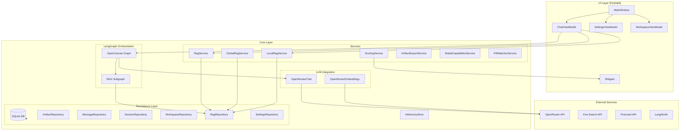
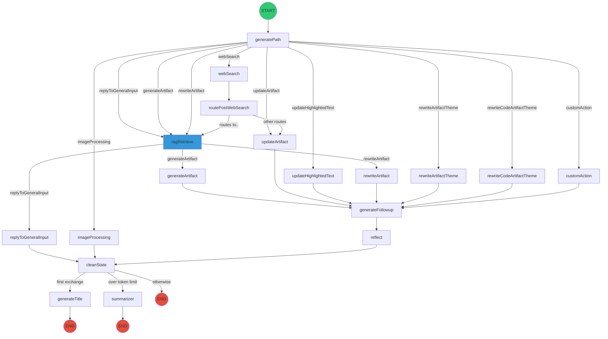
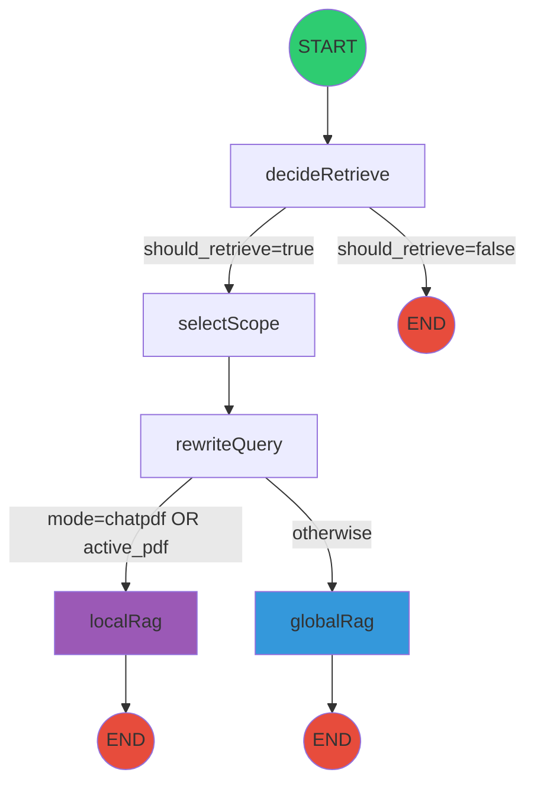
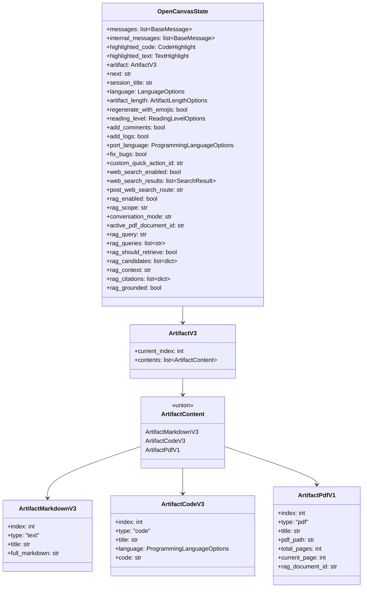
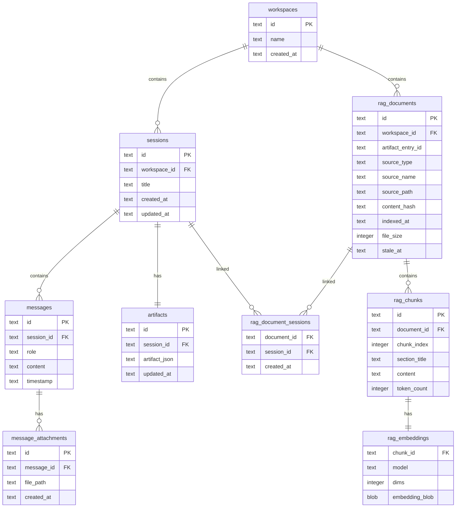
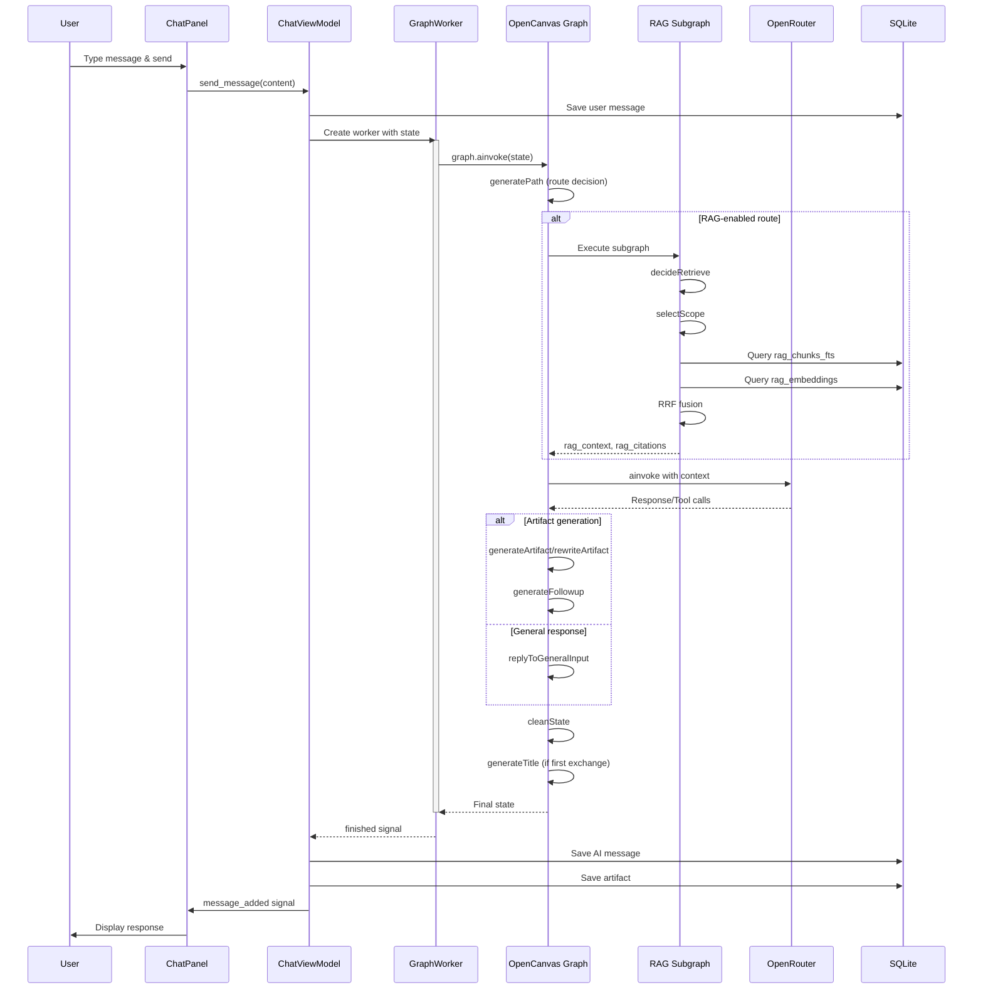
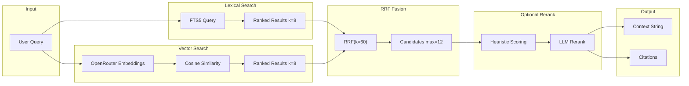
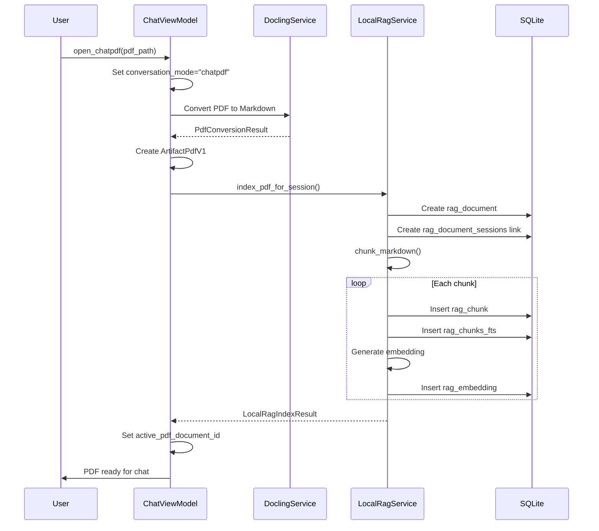
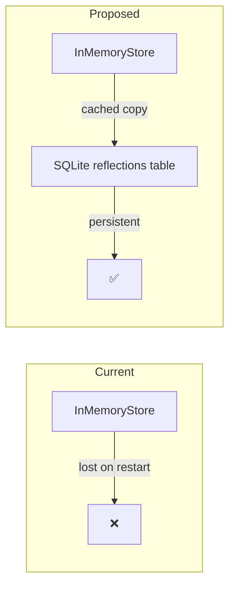

# Attractor Desk - Technical Codebase Report
 
---

## Table of Contents

1. [System Architecture Overview](#1-system-architecture-overview)
2. [LangGraph Execution Graphs](#2-langgraph-execution-graphs)
3. [LangGraph State / Data Stores](#3-langgraph-state--data-stores)
4. [Information Flow](#4-information-flow)
5. [Architectural Issues](#5-architectural-issues)
6. [Identified Bugs](#6-identified-bugs)
7. [Legacy or Unused Code](#7-legacy-or-unused-code)
8. [Architectural Improvements](#8-architectural-improvements)
9. [Code-Level Improvements](#9-code-level-improvements)

---

## 1. System Architecture Overview

### 1.1 High-Level Architecture

Attractor Desk is a **native Python desktop application** for AI-assisted writing and coding. It implements a clean separation between core business logic and UI presentation.



### 1.2 Main Components

| Component | Location | Responsibility |
|-----------|----------|----------------|
| **MainWindow** | `ui/main_window.py` | Primary UI container, orchestrates panels and navigation |
| **ChatViewModel** | `ui/viewmodels/chat_viewmodel.py` | Manages chat state, message flow, graph execution |
| **SettingsViewModel** | `ui/viewmodels/settings_viewmodel.py` | User preferences, API keys, RAG configuration |
| **OpenCanvas Graph** | `core/graphs/open_canvas/graph.py` | Main LangGraph with 18 nodes for conversation routing |
| **RAG Subgraph** | `core/graphs/rag/graph.py` | Separate graph for retrieval-augmented generation |
| **OpenRouterChat** | `core/llm/openrouter.py` | LLM wrapper supporting all OpenRouter models |
| **RagService** | `core/services/rag_service.py` | Hybrid RAG with FTS5 + vector similarity + RRF fusion |
| **Database** | `core/persistence/database.py` | SQLite manager with WAL mode and thread-local connections |

### 1.3 Architectural Patterns

| Pattern | Implementation |
|---------|----------------|
| **MVVM** | ViewModels emit Qt Signals; Widgets bind to these signals |
| **Repository Pattern** | All database access via repository classes |
| **Graph-Based Agent** | LangGraph StateGraph for conversation routing |
| **Hybrid RAG** | Combines FTS5 lexical search with vector similarity using RRF |
| **Dependency Injection** | Services/repositories passed to ViewModels at construction |

---

## 2. LangGraph Execution Graphs

### 2.1 Main OpenCanvas Graph

The primary graph contains **18 nodes** handling conversation, artifact generation, web search, and RAG retrieval.



### 2.2 Node Descriptions

| Node | Purpose |
|------|---------|
| `generatePath` | LLM-based router determining next action based on user intent |
| `ragRetrieve` | Executes RAG subgraph for context retrieval |
| `replyToGeneralInput` | Generates conversational responses (no artifact changes) |
| `generateArtifact` | Creates new text/code artifacts via tool calling |
| `rewriteArtifact` | Modifies existing artifacts based on user requests |
| `rewriteArtifactTheme` | Theme-based text transformations (language, length, emojis) |
| `rewriteCodeArtifactTheme` | Code transformations (add comments, logs, port language) |
| `updateArtifact` | Updates highlighted code sections |
| `updateHighlightedText` | Updates highlighted text sections |
| `customAction` | Executes user-defined quick actions |
| `webSearch` | Classifies, generates query, and searches via Exa |
| `routePostWebSearch` | Routes to intended destination after web search |
| `imageProcessing` | Handles image analysis with multimodal models |
| `generateFollowup` | Generates follow-up messages after artifact changes |
| `cleanState` | Clears transient state fields |
| `reflect` | Placeholder for reflection/memory scheduling |
| `generateTitle` | Auto-generates session titles after first exchange |
| `summarizer` | Summarizes messages when exceeding token limits |

### 2.3 RAG Subgraph



| Node | Purpose |
|------|---------|
| `decideRetrieve` | Determines if RAG retrieval is needed |
| `selectScope` | Chooses scope: session, workspace, or global |
| `rewriteQuery` | Optionally rewrites query for better retrieval |
| `globalRag` | Retrieves from global document corpus |
| `localRag` | Retrieves from session-specific PDF documents |

---

## 3. LangGraph State / Data Stores

### 3.1 OpenCanvasState Structure



### 3.2 Database Schema



**Additional Standalone Tables:**

| Table | Description |
|-------|-------------|
| `rag_chunks_fts` | FTS5 virtual table indexing `rag_chunks` for full-text search |
| `rag_index_registry` | Tracks file indexing status with columns: `source_path`, `content_hash`, `status`, `retry_count`, `error_message`, `embedding_model` |
| `settings` | Key-value store for app settings with columns: `key`, `value`, `category`, `updated_at` |

### 3.3 In-Memory Store

The system uses `InMemoryStore` from LangGraph for storing **reflections** (user style preferences and memory):

```python
# core/store/__init__.py
store = InMemoryStore()  # Non-persistent across restarts

# Usage in nodes
memories = store.get(["memories", assistant_id], "reflection")
# Returns Reflections(style_rules=[], content=[])
```

> [!WARNING]
> Reflections are **not persisted** to SQLite. They reset on application restart.

---

## 4. Information Flow

### 4.1 End-to-End Message Flow



### 4.2 RAG Retrieval Flow



### 4.3 PDF Import Flow (ChatPDF Mode)



---

## 5. Architectural Issues

### 5.1 Tight Coupling: Database Path Hardcoded

**Location**: `core/persistence/database.py:155`

```python
if db_path is None:
    db_path = Path.home() / ".open_canvas" / "database.db"  # Not ".attractor_desk"
```

**Problem**: The default path uses legacy `.open_canvas` instead of the new `.attractor_desk` project name. This inconsistency could cause confusion and data location issues.

**Impact**: Medium - Users may have difficulty locating their data.

---

### 5.2 Non-Persistent Reflection Store

**Location**: `core/store/__init__.py`

**Problem**: The `InMemoryStore` used for reflections/memories is not persisted to the database. All learned user preferences are lost on application restart.

**Impact**: High - Significantly degrades the "memory" feature advertised in the README.

---

### 5.3 Service Instantiation in Nodes

**Location**: `core/graphs/rag/nodes.py:97-98`

```python
repository = RagRepository(Database())  # New instance every call
service = RagService(repository)
```

**Problem**: Each RAG node invocation creates new `Database` and `RagRepository` instances. While thread-local connections mitigate connection issues, this is wasteful and prevents connection pooling.

**Impact**: Medium - Performance overhead and potential for resource leaks.

---

### 5.4 Mixed Async/Sync Patterns

**Location**: Multiple files including `rag_service.py`

**Problem**: The codebase inconsistently mixes synchronous and asynchronous code:
- Graph nodes are `async` functions
- `RagService.retrieve()` is synchronous
- Embeddings are fetched synchronously within async context

**Impact**: Medium - Blocks the event loop, potential performance degradation.

---

### 5.5 RAG Settings Pass-Through Complexity

**Location**: `core/graphs/rag/nodes.py:82-93`

```python
settings = RagRetrievalSettings(
    scope=scope,
    k_lex=int(configurable.get("rag_k_lex", 8)),
    k_vec=int(configurable.get("rag_k_vec", 8)),
    # ... 8 more settings
)
```

**Problem**: RAG settings are passed through multiple layers (ViewModel → Config → Node → Service) with repetitive key extraction. This violates DRY and makes changes error-prone.

**Impact**: Low - Maintainability concern.

---

### 5.6 Lack of Proper Error Boundaries

**Location**: `core/graphs/open_canvas/nodes/generate_path.py:173-178`

```python
except Exception as e:
    import logging  # Import inside except block
    logging.warning(f"Error during route determination: {e}...")
```

**Problem**: Errors are caught and logged but not properly propagated or handled. Import statements inside except blocks are poor practice.

**Impact**: Medium - Silent failures can lead to unexpected behavior.

---

## 6. Identified Bugs

### 6.1 Message Role Conversion Bug

**Location**: `core/graphs/open_canvas/nodes/reply_to_general_input.py:75`

```python
*[{"role": m.type, "content": m.content} for m in messages],
```

**Problem**: Uses `m.type` which returns `"human"` or `"ai"`, but OpenRouter expects `"user"` or `"assistant"`.

**Fix**:
```python
*[{"role": "user" if m.type == "human" else "assistant", "content": m.content} for m in messages],
```

---

### 6.2 Potential Division by Zero in Cosine Similarity

**Location**: `core/services/rag_service.py:425-432`

```python
def _cosine_similarity(query: list[float], vector: list[float], query_norm: float) -> float:
    # No check for zero norm
    dot = sum(q * v for q, v in zip(query, vector))
    vec_norm = math.sqrt(sum(v * v for v in vector))
    return dot / (query_norm * vec_norm)  # Potential ZeroDivisionError
```

**Fix**:
```python
if query_norm == 0 or vec_norm == 0:
    return 0.0
return dot / (query_norm * vec_norm)
```

---

### 6.3 Unhandled PDF Artifact in Title Generation

**Location**: `core/graphs/open_canvas/graph.py:201-213`

```python
if is_artifact_markdown_content(current_content):
    artifact_text = current_content.full_markdown
elif is_artifact_code_content(current_content):
    artifact_text = current_content.code
else:
    artifact_text = ""  # PDF artifacts silently ignored
```

**Problem**: PDF artifacts (`ArtifactPdfV1`) have no `full_markdown` or `code` attribute, so they contribute empty string to title context.

**Fix**: Add explicit handling for PDF artifacts:
```python
elif hasattr(current_content, 'pdf_path'):
    artifact_text = f"PDF: {current_content.title}"
```

---

### 6.4 Race Condition in GraphWorker Cleanup

**Location**: `ui/viewmodels/chat_viewmodel.py`

**Problem**: The `_current_run_token` is used to filter stale responses, but there's a race condition between checking the token and processing the result if multiple graph runs complete simultaneously.

**Fix**: Use proper mutex/lock around state updates or implement a queue-based approach.

---

### 6.5 FTS5 Injection Vulnerability

**Location**: `core/persistence/rag_repository.py`

**Problem**: User-provided search queries are passed to FTS5 without proper escaping, potentially allowing FTS5 syntax injection.

**Fix**: Escape special FTS5 characters (`"`, `AND`, `OR`, `NOT`, `*`, etc.) before querying.

---

## 7. Legacy or Unused Code

### 7.1 Unused `reproduce_issue.py`

**Location**: `/reproduce_issue.py`

**Recommendation**: **Remove** - Appears to be debug/test code from issue reproduction.

---

### 7.2 Legacy `API_KEY.txt` Support

**Location**: `core/config.py`, `README.md`

**Status**: Documented as deprecated but still supported with migration.

**Recommendation**: **Keep** for backwards compatibility, but add deprecation warnings to logs.

---

### 7.3 Placeholder `reflect_node`

**Location**: `core/graphs/open_canvas/graph.py:362-365`

```python
async def reflect_node(state: OpenCanvasState):
    """Placeholder for reflection trigger."""
    # TODO: Implement reflection scheduling
    return {}
```

**Recommendation**: Either **implement** reflection scheduling or **remove** from graph if not planned.

---

### 7.4 Unused Import in `generate_path.py`

**Location**: `core/graphs/open_canvas/nodes/generate_path.py:175`

```python
except Exception as e:
    import logging  # Imported inside except block
```

**Recommendation**: Move to top-level imports.

---

### 7.5 Duplicate Schema Creation

**Location**: `core/persistence/database.py:191-206`

The `_ensure_rag_index_registry` method recreates the table that already exists in `SCHEMA`. This is redundant.

**Recommendation**: Remove duplicate table creation, keep only in `SCHEMA`.

---

## 8. Architectural Improvements

### 8.1 Persist Reflections to SQLite

**Current**: Reflections stored in `InMemoryStore` (volatile)

**Proposed**:


**Implementation**:
1. Add `reflections` table to schema
2. Create `ReflectionsRepository`
3. Modify `core/store/__init__.py` to sync with database
4. Load reflections at startup

---

### 8.2 Dependency Injection for Database/Repository

**Current**: Nodes instantiate `Database()` and repositories directly

**Proposed**: Use LangGraph configurable to inject shared instances

```python
# In graph configuration
config = {
    "configurable": {
        "database": db_instance,
        "rag_repository": rag_repo,
        ...
    }
}
```

---

### 8.3 Async RAG Service

**Current**: `RagService.retrieve()` is synchronous

**Proposed**: Make async with `asyncio.to_thread()` for CPU-bound operations

```python
async def retrieve_async(...) -> RagRetrievalResult:
    return await asyncio.to_thread(self.retrieve, ...)
```

---

### 8.4 Centralized RAG Configuration

**Current**: Settings scattered across ViewModel → Config → Nodes

**Proposed**: Create `RagConfig` dataclass passed as single object

```python
@dataclass
class RagConfig:
    enabled: bool
    scope: str
    k_lex: int
    k_vec: int
    embedding_model: str
    # ... all RAG settings
```

---

### 8.5 Error Handling Strategy

**Current**: Mixed approaches (silent failures, raised exceptions, logged warnings)

**Proposed**: Implement consistent error boundary pattern

```python
class GraphExecutionError(Exception):
    """Base exception for graph execution failures."""
    pass

class RagRetrievalError(GraphExecutionError):
    """RAG retrieval failed."""
    pass
```

---

## 9. Code-Level Improvements

### 9.1 Consistent Logging

**Current Issue**: Mix of `print(f"[DEBUG]...")` and `logging.info/warning`

**Improvement**:
```python
# Before
print(f"[DEBUG] Generated artifact: type={artifact_type}")

# After
logger = logging.getLogger(__name__)
logger.debug("Generated artifact: type=%s, title=%s", artifact_type, title)
```

---

### 9.2 Type Hints Completion

**Current Issue**: Some functions lack return type hints

**Example Fix**:
```python
# Before
def route_node(state: OpenCanvasState):

# After
def route_node(state: OpenCanvasState) -> str:
```

---

### 9.3 Extract Magic Numbers

**Current**:
```python
if len(messages) > 2:  # Magic number
total_chars > CHARACTER_MAX  # Better: uses constant
```

**Improvement**: Define all thresholds as constants in `core/constants.py`

```python
# core/constants.py
FIRST_EXCHANGE_MESSAGE_COUNT = 2
RAG_MIN_QUERY_LENGTH = 2
```

---

### 9.4 Reduce Code Duplication in Nodes

**Current**: Similar patterns repeated across nodes:
- Get model configuration
- Get reflections
- Build prompt
- Invoke model

**Improvement**: Create utility functions

```python
# core/graphs/open_canvas/nodes/utils.py
def get_model_from_config(config: RunnableConfig, **kwargs) -> OpenRouterChat:
    configurable = config.get("configurable", {})
    return get_chat_model(
        model=configurable.get("model", DEFAULT_MODEL),
        api_key=configurable.get("api_key"),
        **kwargs
    )

def get_reflections_str(config: RunnableConfig) -> str:
    store = get_store()
    assistant_id = config.get("configurable", {}).get("assistant_id", "default")
    memories = store.get(["memories", assistant_id], "reflection")
    if memories and memories.value:
        return get_formatted_reflections(Reflections(**memories.value))
    return "No reflections found."
```

---

### 9.5 Improve Error Messages

**Current**:
```python
raise ValueError("No artifact to rewrite")
```

**Improvement**:
```python
raise ValueError(
    "Cannot rewrite artifact: No artifact exists in current session. "
    "Use 'generateArtifact' route for new artifacts."
)
```

---

### 9.6 Use Pydantic Validators

**Current**: Manual validation scattered in code

**Improvement**: Use Pydantic validators

```python
class RagRetrievalSettings(BaseModel):
    k_lex: int = 8
    k_vec: int = 8
    
    @validator('k_lex', 'k_vec')
    def positive_k(cls, v):
        if v < 1:
            raise ValueError('k values must be positive')
        return v
```

---

## Summary

Attractor Desk is a well-structured Python desktop application demonstrating solid architectural patterns including MVVM, Repository, and Graph-based Agent orchestration. The LangGraph implementation is particularly sophisticated with its 18-node main graph and dedicated RAG subgraph.

**Key Strengths**:
- Clean core/UI separation
- Comprehensive RAG with hybrid search
- Multi-artifact versioning
- Thread-safe database access

**Priority Fixes**:
1. Persist reflections to SQLite (High Impact)
2. Fix message role conversion bug (Breaking)
3. Add FTS5 input sanitization (Security)
4. Correct database path to `.attractor_desk` (Consistency)

**Technical Debt**:
- Async/sync pattern inconsistency
- Service instantiation in nodes
- Placeholder nodes requiring implementation or removal
